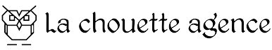

#  OpenClassrooms-Développeur Web

_`Début de formation  Avril/2021`_

## Auteur

👤 &nbsp; **Driss KOHKOH** [🇫🇷 Contactez moi 🇬🇧](mailto:kohkoh.driss@gmail.com)
=======

* Github: [@Driss Kohkoh](https://github.com/kohkohdriss)
* LinkedIn: [@kohkoh driss](https://www.linkedin.com/in/driss-kohkoh/)
* Visitez ==> 🏠 [e-portfolio](https://driss-kohkoh.jimdosite.com/)

***
## 📎 Projet 4 - Optimisez le site web existant "La chouette agence"

***
### Optimiser le SEO d'un site

Le site optimisé hébergé sur GitHub: [La Chouette agence](https://github.com/kohkohdriss/Webdesign-Lyon.git/)

#### 🔨 Optimisez un site web existant

##### Compétences évalué

* Réaliser une recherche des bonnes pratiques en développement web
* Assurer l'accessibilité d'un site web
* Écrire un code HTML et CSS maintenable
* Optimiser la taille et la vitesse d’un site web
* Optimiser le référencement d'un site web

***

##### Objectifs

* Analyse de l’état actuel de SEO du site fourni.
* 10 recommandations pour améliorer le SEO du site.
* Amélioration du SEO du site.
* Accessibilité du site web.
* EComparaison des résultats.

***

##### Travail réalisé

Le sujet porte sur l'optimisation du site [La Chouette agence](https://github.com/kohkohdriss/Webdesign-Lyon.git), (hébergé sur GitHub) via la mise en œuvre de 10 recommandations SEO.
Il faut également garantir l'accessibilité mobile du site en respectant les critères d'accessibilité sur [WCAG v2.0](https://www.w3.org/Translations/WCAG20-fr/).

Mes 10 recommandations se repartissent en 5 parties (voir détail dans les Livrables):

1. Supprimer les éléments pouvant s'apparenter à du "black hat".
2. Mise en œuvre des bonnes pratiques d’accessibilité.
3. SEO ON-PAGE - Optimisation technique du site et de la vitesse de chargement des pages.
4. SEO ON-PAGE - Mise en place d'une structure technique optimisée.
5. SEO ON-PAGE - Contenu reprenant les mots clés.

Les liens partenaires du footer ont été déplacés vers la nouvelle page [Partenaires](partenaires.html). 
Les liens partenaires ne pointent nulle part => [Redirection 404](https://github.com/kohkohdriss/Webdesign-Lyon/page-404.html). 
Une nouvelle page de redirection a été crée en attendant de mettre les liens définitifs. 
Cette redirection fonctionne grâce au fichier `.htaccess` placé à la racine du site. 
Sur GitHub les fichiers `.htaccess` ne sont pas pris en charge.

***

##### Utilisé dans ce projet

* Voir : [Le projet sur OpenClassrooms](https://openclassrooms.com/fr/paths/185/projects/638/assignment "Cliquez pour voir le projet")

* Le site avant optimisation : [La Chouette agence](https://github.com/kohkohdriss/Webdesign-Lyon.git/)

* Liste à implémenter : [Check-list pour l'accessibilité mobile
](https://developer.mozilla.org/fr/docs/Accessibilit%C3%A9/Checklist_accessibilite_mobile)

* Les sites de tests en ligne: Dareboost, Accessibility Checker, Google PageSpeed Insights, GTmetrix, My Pingdom, GiftOfSpeed, Chrome Contrast couleurs.

| Languages       | et                    | outils     |
| :-------------: |:-------------:        | :-----:    |
| HTML5           | Bootstrap              | ImageOptim |
| CSS3            | Git/GitHub                   | Chrome DevTools |
| JS              | Google Search console |  Visual Studio Code    |

***

### 🚦Les documents de présentation

:white_check_mark: [Guide de test d'accessibilité des WCAG](https://github.com/kohkohdriss/archive/blob/main/projet_04/Guide%2Bde%2Btest%2Bd'accessibilite%CC%81%2Bdes%2BWCAG.pdf)\
:white_check_mark: [Analyse SEO Audit](https://github.com/kohkohdriss/archive/blob/main/projet_04/P4_01_analyse_SEO_Audit.pdf)\
:white_check_mark: [Rapport d'optimisation du SEO](https://github.com/kohkohdriss/archive/blob/main/projet_04/P4_03_rapport_d'optimisation.pdf)\

***

&hearts; Love Markdown

